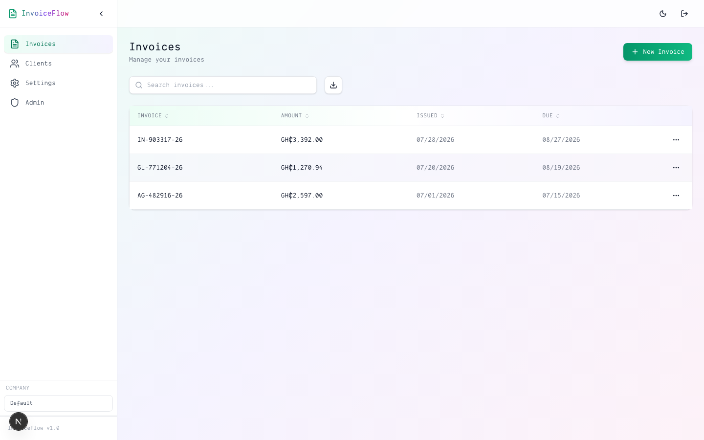
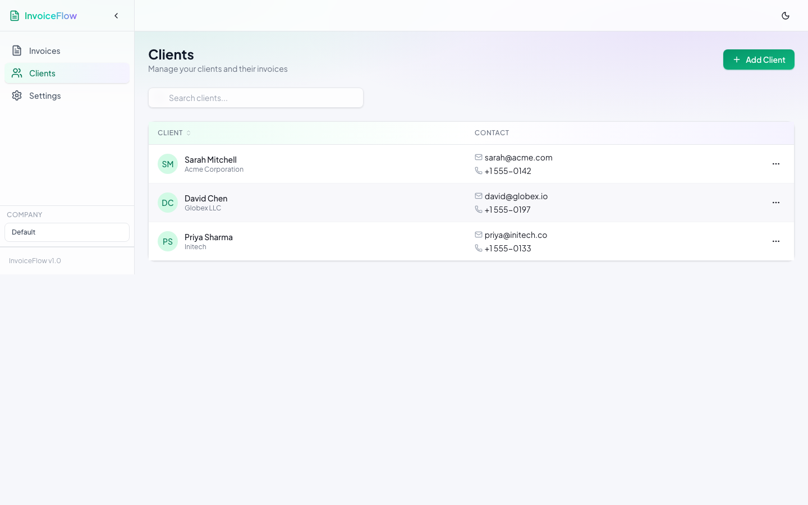
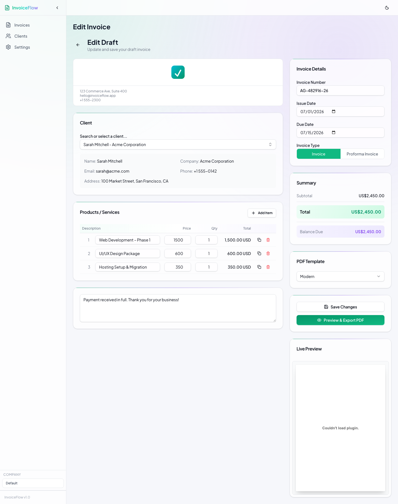
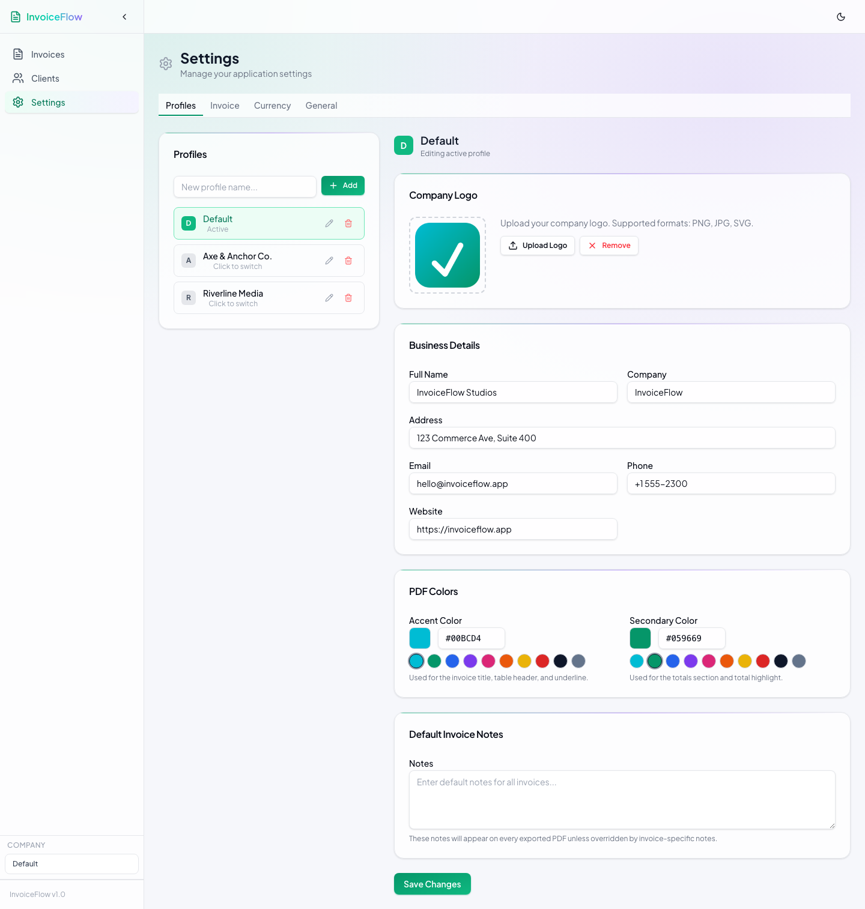
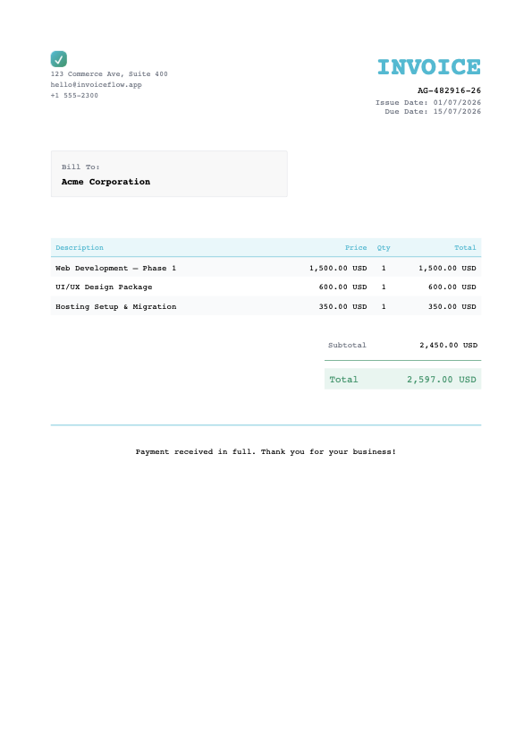

# InvoiceFlow

A native macOS invoice generator. Create clients, build invoices, and export clean PDFs from your desktop.

## Download

[**InvoiceFlow-2.0.0-arm64.dmg**](dist/InvoiceFlow-2.0.0-arm64.dmg) — requires macOS 14.0+

## What It Does

**Clients** — Store client name, company, email, phone, and address. Search by any field.

**Invoices** — Create and edit invoices with line items, notes, tax, and discount. Invoice numbers use a sequential format (e.g. `INV-26-0001`) based on client name prefix + year + sequence. Duplicates get the next number automatically.

**PDF Export** — Two templates (Dark and Light) with live preview. Pick your accent color, secondary color, font family, and font size before exporting. Supports A3, A4, Letter, and Legal paper sizes.

**Profiles** — Run multiple business identities. Each profile keeps its own company info, logo, default colors, currency, and PDF settings. Switch between profiles without losing anything.

## Features

- Dark and Light PDF templates with customizable accent and secondary colors
- Font family and font size control for exported PDFs
- Logo upload with live preview
- Sequential invoice numbering (`INV-YY-NNNN`)
- Invoice and Proforma Invoice types
- Line items with description, quantity, unit price, and auto-calculated totals
- Configurable currency (USD, EUR, GBP, GHS, CAD, NGN, ZAR)
- Number formatting: comma/period separator, 0-4 decimal places, before/after symbol
- Date format options: MM/DD/YYYY, DD/MM/YYYY, YYYY-MM-DD, DD MMM YYYY
- Paper sizes: A3, A4, Letter, Legal
- Configurable export folder path
- Context menus: Edit, Delete, Duplicate, Export PDF, View Details
- Invoice detail view with close button and export shortcut
- Client search by name, company, email, phone, or address
- Onboarding flow on first launch
- Local data storage via SwiftData (no cloud, no accounts)

## Screenshots

| Invoices | Clients |
|---|---|
|  |  |

| Invoice Editor | Settings |
|---|---|
|  |  |

| Generated PDF |
|---|
|  |

## Tech Stack

- **SwiftUI** — native macOS interface
- **SwiftData** — local persistence
- **PDFKit** — PDF rendering and export
- **macOS 14.0+**

## Development

```bash
# Clone
git clone https://github.com/Perigrino/Invoice_App.git
cd Invoice_App

# Build
xcodebuild build -scheme InvoiceFlow -destination 'platform=macOS'

# Run tests
xcodebuild test -scheme InvoiceFlow -destination 'platform=macOS'
```

## Changelog

### v2.0.0

- Dark and Light PDF templates replace the old 5-template system
- Sequential invoice numbering (client prefix + year + 4-digit sequence)
- Font family and font size customization in PDF export
- Enlarged logo preview in settings
- Configurable export folder path
- Invoice detail view with close button
- Bug fixes: PDF rendering now produces non-blank output on macOS 14+

### v0.2.0

- Initial native macOS release
- Client and invoice management
- PDF export with templates

### v1.8 (Legacy Web)

- Mobile-friendly redesign with drawer navigation and card-based lists

### v1.7 (Legacy Web)

- Currency configurability with comma/period separators and symbol placement

### v1.6 (Legacy Web)

- PDF invoice generation with professional templates

## License

MIT
